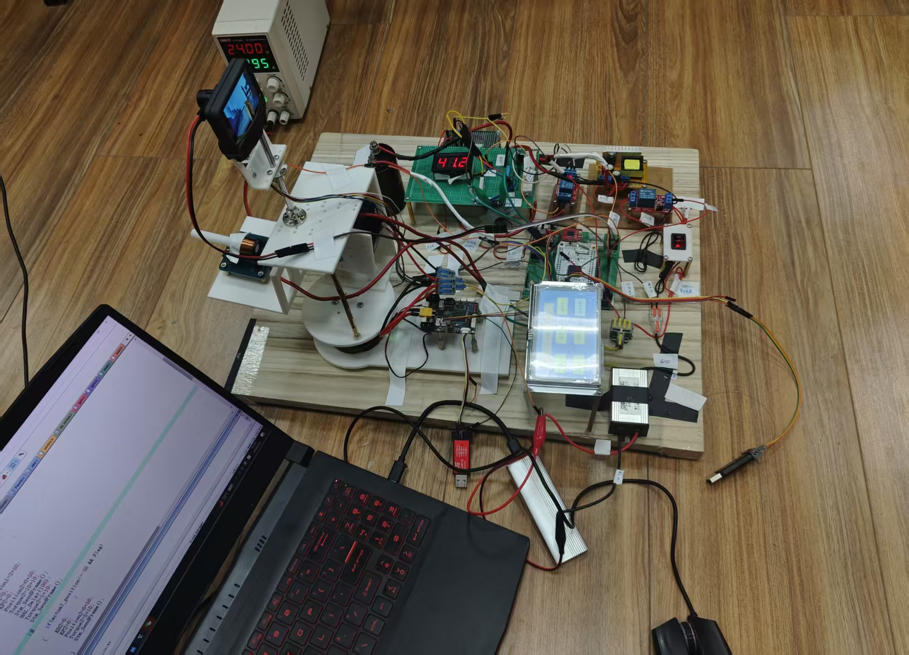
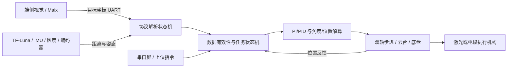

# Embedded AI Shooting Systems

> 面向端侧嵌入式开发 / AI 射击产品岗位的双项目作品集：从视觉与传感器输入，到协议解析、闭环控制、执行机构驱动和整机联调。

<p align="center">
  
  
</p>

<p align="center"><b>激光打靶小车（左） · 视觉辅助曲射电磁发射系统（右）</b></p>

## 项目概览

这是对两套真实硬件原型的公开作品集整理，不是课程 Demo：

| 项目 | 核心平台 | 感知与通信 | 控制与执行 | 结果 |
| --- | --- | --- | --- | --- |
| [全国大学生电子设计竞赛激光打靶小车](projects/laser-targeting-vehicle/) | TI MSPM0G3507 · 裸机中断 | 视觉坐标、5 路灰度、IMU、编码器、4 路 UART | PI/PID、双轴步进、多电机同步、任务状态机 | 2025 全国大学生电子设计竞赛全国二等奖；本人担任队长 |
| [视觉辅助曲射电磁发射系统](projects/electromagnetic-launcher/) | STM32F407VET6 · 168 MHz · HAL | Maix 视觉坐标、TF-Luna 测距、串口屏、板间 UART | 扫描—锁定—测距—解算—瞄准—互锁触发 | 完成多板协同、端侧视觉接入与闭环执行原型 |

## 与端侧 AI 射击岗位的匹配点

- **智能硬件端侧落地**：能够把视觉模块输出转换为 MCU 可消费的数据帧，并继续完成解析、控制和执行，而不仅停留在模型调用。
- **多传感器与协议对接**：使用中断式 UART 接入视觉坐标、TF-Luna、IMU、串口屏和板间通信，按字节状态机处理帧头、载荷、帧尾与校验。
- **控制算法工程化**：将位置误差、姿态与距离数据接入 PI/PID、限幅、同步运动和分阶段状态机，驱动电机与云台完成闭环动作。
- **完整项目经验**：覆盖传感器 → 主控 → 执行机构的完整链路，包含板级调试、参数整定、异常复位与整机联调。
- **AI + 嵌入式方向**：视觉/AI 推理运行在 Maix 等端侧模块，MCU 负责实时协议、控制与安全执行，形成清晰的异构协同边界。

## 系统数据流



更详细的数据链路与模块边界见 [系统架构说明](docs/architecture.md)。

## 可核验的代码证据

以下链接可直接对应简历中的能力描述：

| 能力 | 代码入口 | 可见实现 |
| --- | --- | --- |
| 多点视觉坐标协议 | [`eyes1.c`](projects/laser-targeting-vehicle/firmware/eyes1.c) | `0x55 + 5 组坐标 + 0xFF` 的逐字节解析状态机 |
| 视觉闭环跟踪 | [`track.c`](projects/laser-targeting-vehicle/firmware/track.c) | PI/PID、积分与速度限幅、多运动工况参数 |
| 多执行器同步 | [`question4.c`](projects/laser-targeting-vehicle/firmware/question4.c) | 双轴目标跟踪、同步触发、任务分阶段控制 |
| IMU 姿态解析 | [`gyro.c`](projects/laser-targeting-vehicle/firmware/gyro.c) | 角速度/角度帧解析、偏航角换算与相对角计算 |
| 5 路 UART 并发接入 | [`gyro.c`](projects/electromagnetic-launcher/firmware/app/gyro.c) | 一个回调分发 Maix、串口屏、TF-Luna、板间数据，并立即重启非阻塞接收 |
| Maix 坐标接入 | [`maix.c`](projects/electromagnetic-launcher/firmware/app/maix.c) | 帧头/帧尾校验与二维坐标重组 |
| TF-Luna 测距接入 | [`luna.c`](projects/electromagnetic-launcher/firmware/app/luna.c) | 双帧头、校验和、距离/强度解析与有效性判定 |
| 瞄准与安全触发流程 | [`Fourth.c`](projects/electromagnetic-launcher/firmware/app/Fourth.c) | 扫描、目标居中、距离限幅、角度解算、互锁触发与复位 |
| 双 MCU 参数同步 | [`stm.c`](projects/electromagnetic-launcher/firmware/app/stm.c) | 位置、KP/KD、力矩等参数的自定义帧下发 |

## 仓库结构

```text
.
├─ docs/
│  ├─ architecture.md
│  └─ images/
└─ projects/
   ├─ laser-targeting-vehicle/
   │  ├─ README.md
   │  └─ firmware/                  # MSPM0 源码、SysConfig 与 CCS 配置
   └─ electromagnetic-launcher/
      ├─ README.md
      └─ firmware/                  # STM32CubeMX/Keil 工程、应用层源码及依赖
```

编译产物、IDE 缓存、用户配置与本机绝对路径已从公开快照中移除；原有 GBK 中文注释已在本仓库副本中统一为 UTF-8，便于在线阅读。

## 快速复现

### 1. 激光打靶小车

- MCU：TI MSPM0G3507
- IDE：Code Composer Studio
- SDK：MSPM0 SDK 2.01.00.03
- 入口：导入 [`firmware/.project`](projects/laser-targeting-vehicle/firmware/.project)，再根据实际接线核对 [`fengzhuang.syscfg`](projects/laser-targeting-vehicle/firmware/fengzhuang.syscfg)。

### 2. 曲射电磁发射系统

- MCU：STM32F407VET6，主频 168 MHz
- 工具：STM32CubeMX / Keil MDK-ARM
- 入口：打开 [`NEW ENcode.ioc`](projects/electromagnetic-launcher/firmware/NEW%20ENcode.ioc) 生成工程，或使用 [`NEW ENcode.uvprojx`](projects/electromagnetic-launcher/firmware/MDK-ARM/NEW%20ENcode.uvprojx)。
- 应用层：将 [`firmware/app`](projects/electromagnetic-launcher/firmware/app/) 加入工程并配置头文件路径。

> 两套工程均与实物接线、传感器标定和机构参数相关。直接上电前，请先核对 GPIO、供电、电机方向、机械限位及执行机构互锁。

## 关于作者

吴雨宸，南京航空航天大学控制工程硕士研究生；本科为测控技术与仪器专业。长期兴趣方向为 **Embedded AI / AIoT / 机器人感知与控制**，具备嵌入式系统开发、传感器接入和 AI 应用开发基础。

本仓库用于个人技术作品展示与招聘沟通。代码为原型验证快照，未附开源许可证；如需复用或合作，请先联系作者。

