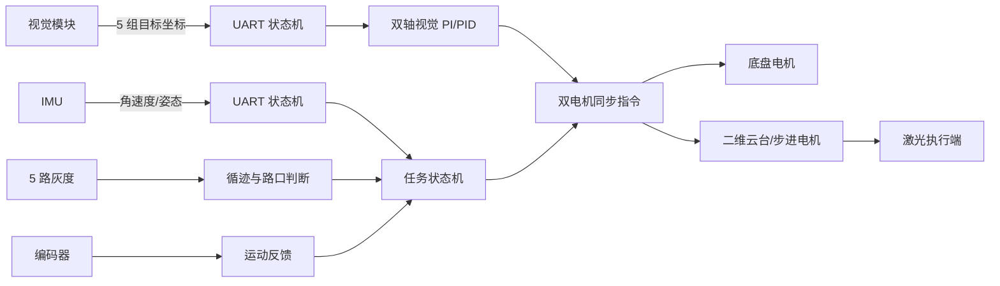
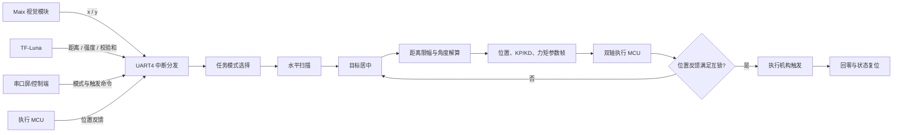

# 系统架构与工程边界

## 1. 激光打靶小车

关键设计：

1. 视觉坐标、IMU 数据采用逐字节状态机接收，主循环只读取已经解析后的变量。
2. 跟踪环包含积分限幅和输出限幅，按前进、侧向、后退等工况拆分参数。
3. 复杂赛题动作拆成多个非阻塞阶段，通过状态变量推进；双轴指令先缓存，再广播同步执行。
4. 灰度、姿态、编码器与视觉各自保持独立模块，任务层进行组合。

## 2. 视觉辅助曲射电磁发射系统

关键设计：

1. 5 路 UART 在统一接收完成回调中按外设实例分发，各协议解析器互不耦合。
2. Maix 端只发送坐标，STM32 端完成协议校验、距离融合、角度/位置计算和执行控制。
3. TF-Luna 帧包含校验和与信号强度判断，避免无效距离直接进入控制链路。
4. 控制 MCU 通过自定义帧向执行 MCU 下发位置、KP/KD 与力矩参数，形成感知与实时执行分层。
5. 发射动作受状态机和位置反馈约束，完成后主动回零，避免连续误触发。

## 3. 与“端侧 AI”岗位的边界说明

本仓库重点展示 **AI/视觉结果如何可靠落到硬件**。视觉模型或图像处理运行在摄像头/端侧算力模块，MCU 固件承担：

- 推理结果协议对接；
- 多源数据有效性判断；
- 实时闭环控制；
- 多执行器同步；
- 安全互锁与异常复位。

该分工与智能硬件产品中常见的“高算力端负责感知、MCU 负责确定性控制”架构一致。当前公开快照未声称在 STM32/MSPM0 上直接运行深度学习推理。

