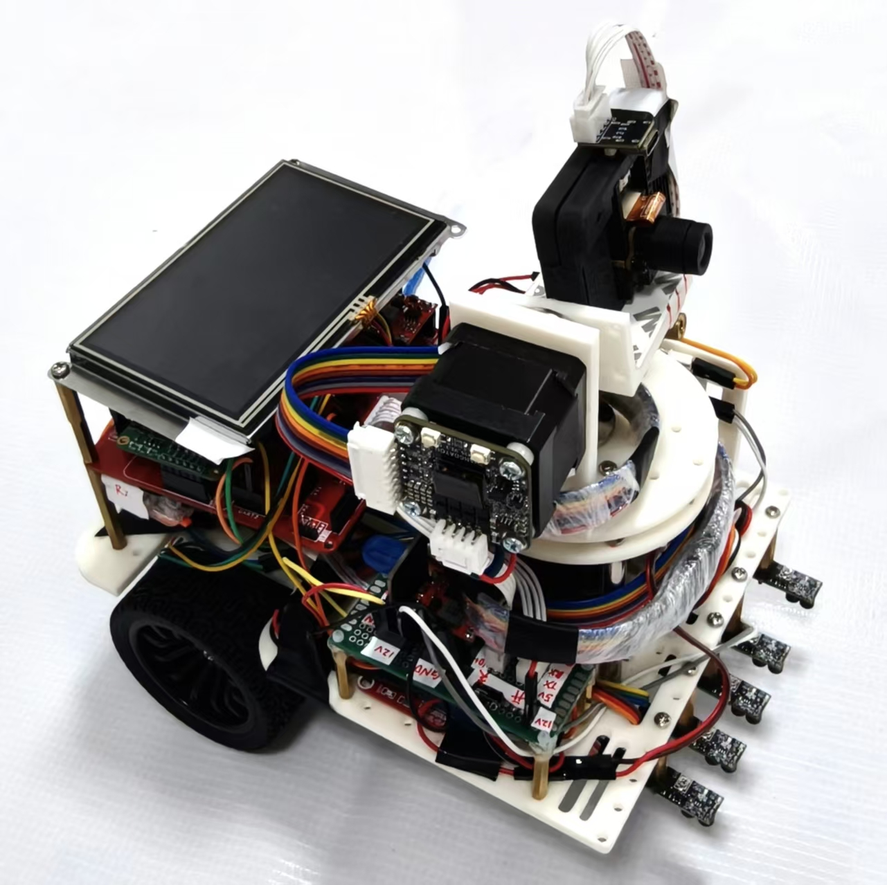

# 激光打靶小车（MSPM0G3507）

2025 全国大学生电子设计竞赛项目，获全国二等奖；本人担任队长，负责系统方案、嵌入式控制、视觉/传感器协议对接与整机联调。

<p align="center"></p>

## 实现内容

- 在 MSPM0G3507 上搭建裸机中断驱动框架，配置 4 路 UART、PWM、定时器与 GPIO。
- 接入视觉坐标、5 路灰度、IMU 与编码器数据，按协议解析后交给任务层融合。
- 实现底盘循迹、偏航修正、双轴视觉跟踪和双步进电机同步动作。
- 将赛题动作拆成多组任务状态机，完成寻迹、定位、瞄准、轨迹运动与执行控制。

## 代码导航

| 文件 | 职责 |
| --- | --- |
| [`firmware/app.c`](firmware/app.c) | 系统初始化、外设启动与任务调度入口 |
| [`firmware/eyes1.c`](firmware/eyes1.c) | 5 组视觉坐标协议解析状态机 |
| [`firmware/track.c`](firmware/track.c) | 视觉跟踪 PI/PID、积分与输出限幅 |
| [`firmware/GrayPID.c`](firmware/GrayPID.c) | 灰度循迹与转向控制 |
| [`firmware/gyro.c`](firmware/gyro.c) | IMU 角速度/姿态解析和偏航角计算 |
| [`firmware/encoder.c`](firmware/encoder.c) | 编码器反馈处理 |
| [`firmware/yc_datou_m0.c`](firmware/yc_datou_m0.c) | 步进电机通信与多机同步控制 |
| [`firmware/question0.c`](firmware/question0.c) ～ [`question4.c`](firmware/question4.c) | 各赛题动作与状态机 |

## 视觉数据帧示例

```text
0x55 | x1 y1 | x2 y2 | x3 y3 | x4 y4 | x5 y5 | 0xFF
```

固件按字节推进接收状态，并在完整帧结束后置位新数据标志，避免主循环直接处理半帧数据。

## 开发环境

- TI Code Composer Studio
- MSPM0 SDK 2.01.00.03
- SysConfig 配置：[`firmware/fengzhuang.syscfg`](firmware/fengzhuang.syscfg)

导入 [`firmware/.project`](firmware/.project) 后，依据实际硬件核对引脚、电机方向、视觉坐标系与控制参数。

